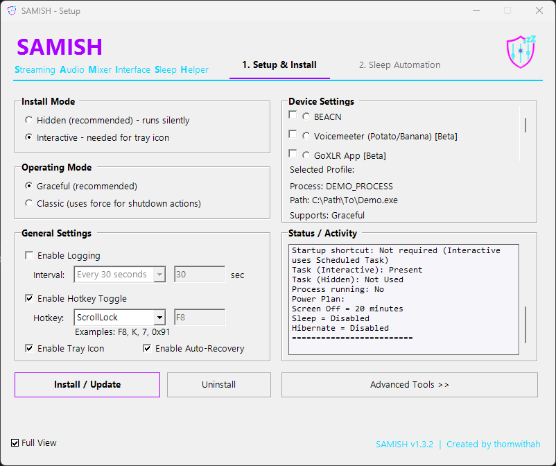
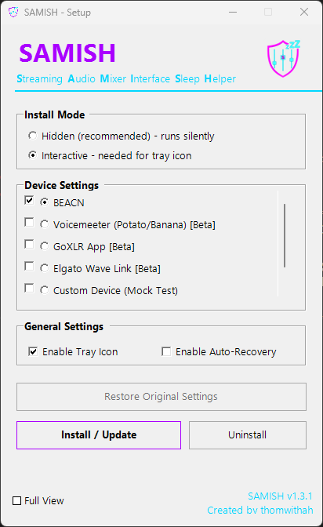
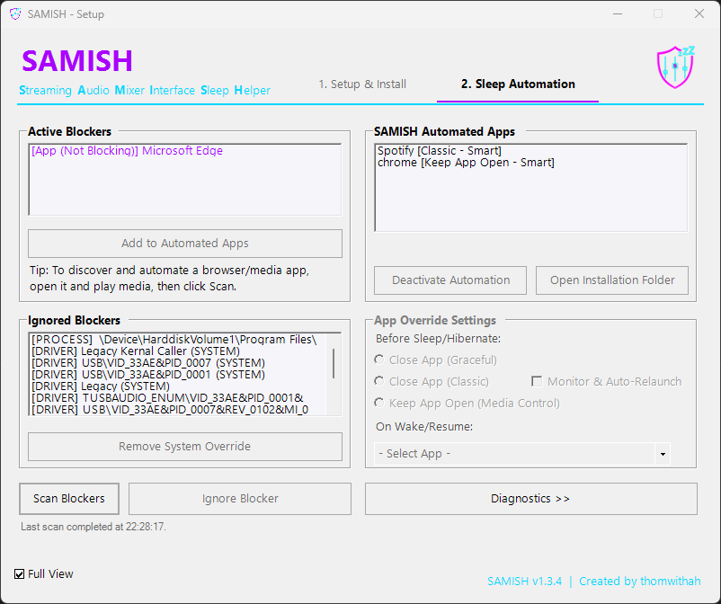
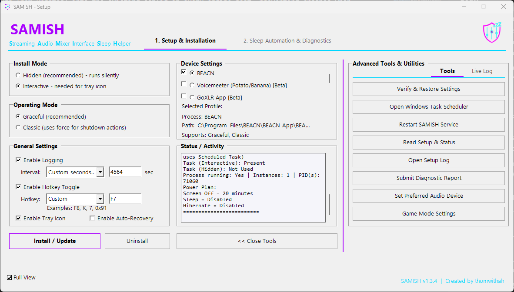
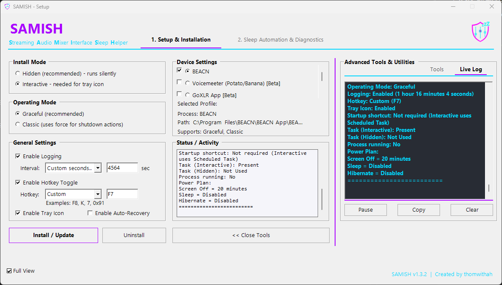
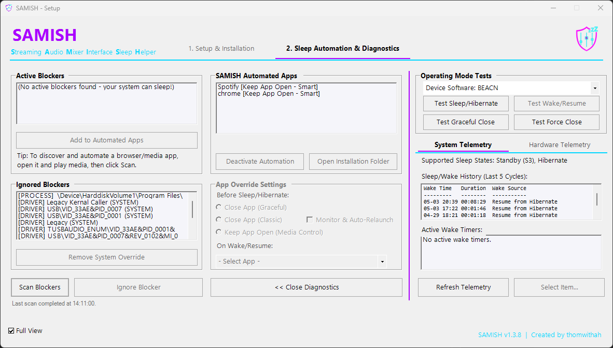
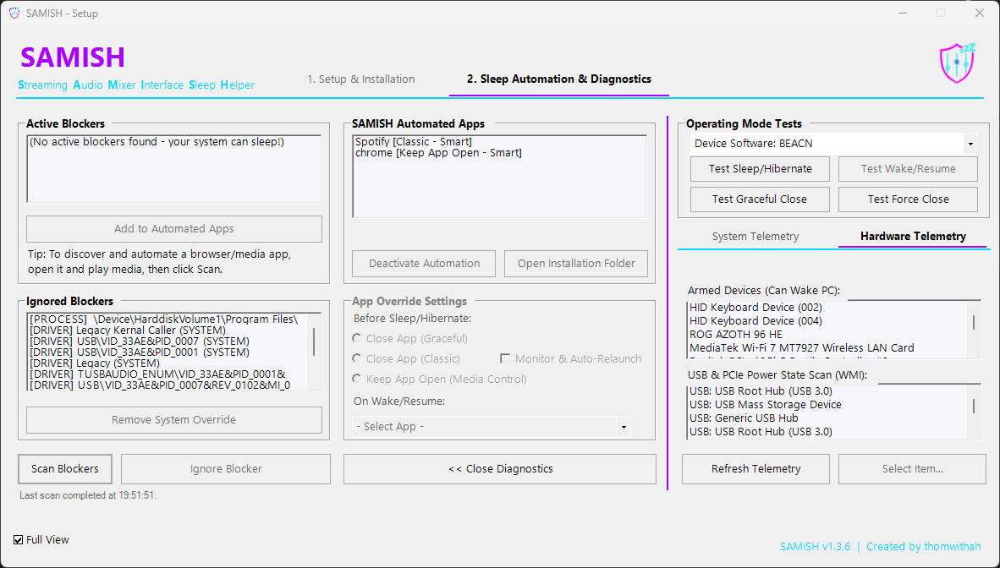

# SAMISH (Streaming Audio Mixer Interface Sleep Helper)
Created by thomwithah | Version: 1.3.3

**Are you having trouble getting Windows to sleep or turn off your screens while your virtual audio mixer (BEACN, Voicemeeter, GoXLR, or Wave Link) is open?**

SAMISH is a lightweight, open-source utility that solves persistent system sleep issues caused by hardware audio routers.

> SAMISH helps your PC, well, act the "same(-ish)" by coaxing your mixer hardware's software to get out of the way of Windows' natural ~~sleep cycle~~ settings. If needed, though, SAMISH is happy to apply a little "force" (via Classic termination mode) to make sure stubborn apps actually go to sleep.

By monitoring system idle states, it automatically closes your audio software when you walk away, and restarts it the second you wake up your PC.

### Common Symptoms SAMISH Fixes:
- **PC won't sleep automatically**: Your computer stays awake forever because the audio software is acting as an active sleep blocker.
- **Monitor won't turn off**: Your displays remain on despite your Windows power plan settings.
- **Computer wakes up instantly**: The system goes to sleep but immediately wakes back up (often showing audio or USB devices in `powercfg` reports).
- **Audio routing breaks after waking up**: Your streaming audio mixer fails to recover or loses its endpoints after a sleep cycle.

> [!WARNING]
> **Windows SmartScreen & Antivirus False Positives**
>
> Because SAMISH is a free, open-source tool compiled from PowerShell scripts, the setup installer (`SAMISH_Setup_v1.3.3.exe` and `Setup.exe`) does not have a paid digital signature. Your web browser and Windows Defender/SmartScreen will likely flag it as an "unrecognized app" or "unsafe file" until it builds up a download reputation.
>
> **What to expect:**
> * **Browser Warning:** Chrome or Edge may warn that the file "is not commonly downloaded." Click the options menu (three dots) and select **Keep**.
> * **Windows SmartScreen:** Windows may show a blue "Windows protected your PC" screen. Click **More info**, then click **Run anyway**.
> * **UAC Admin Prompt:** Setup requires Administrator rights to configure your Windows power profiles (to manage screen sleep timers). Click **Yes** when prompted.
>
> *Transparency is important! If you are ever uncomfortable bypassing these warnings, the complete, uncompiled PowerShell source code is always available in this repository for you to review and run manually.*

---

## How to Run / Install

- Run Setup.bat or Use Setup.exe, or run Setup.ps1 as Administrator with all the "Included Folders and Files" from below in the same folder. 
- Alternatively, you can use the SAMISH_Setup_vX.X.X.exe to install. This will extract all the files needed to a folder and launch the SAMISH GUI. 
- Note: Although the .exe installers make installtion easy expect antivirus software to flag them. 

## TL;DR (for BEACN users)

If BEACN is preventing your PC from sleeping properly or behaving incorrectly after sleep, run SAMISH in Hidden mode and click Install.

SAMISH will:
- Help ensure your system can sleep correctly
- Help reduce common sleep-related issues caused by audio interface software
- Help keep your setup stable without needing ongoing interaction
- Help reduce cases where BEACN fails to recover after sleep

Most users never need to open it again after setup.

---

## Why SAMISH exists

I ran into issues where BEACN was preventing my PC from sleeping properly and sometimes didn't behave correctly after sleep.

I also saw other users reporting similar problems, especially cases where BEACN didn't recover cleanly after sleep or hibernation.

I built this, a small tool called SAMISH, to stabilize how Windows handles sleep around audio devices.

If you just want the simple fix:
- Run SAMISH
- Leave it on Hidden mode
- Click Install / Update
- Accept the power plan fix if prompted

That's it.

It runs silently in the background and keeps things working.

It doesn't modify BEACN directly, but it removes the conditions that typically cause these problems and helps prevent the "doesn't come back after sleep" issue.

---

## Overview

Some streaming audio device software can unintentionally interfere with normal Windows power behavior.

SAMISH helps restore normal sleep behavior by coordinating how Windows transitions into and out of idle states.

SAMISH currently supports **BEACN** software out of the box, and includes new, beta-state support (actively seeking user feedback) for **Voicemeeter**, **GoXLR**, and **Elgato Wave Link** software, with options to define custom profiles for any arbitrary audio control interface.

---

## What it does

- Helps reduce common sleep-related issues caused by audio interface software
- Helps ensure audio mixers, interfaces, and control panels recover and restart cleanly after sleep or hibernation
- Helps maintain a stable runtime environment so audio routing behaves consistently upon wake
- Runs via Windows Task Scheduler so it operates silently in the background

---

## Included files

Keep these files and folders together in the same directory:
- App/ (contains the core application components, tasks, and modules)
- Setup.ps1
- Setup.bat
- Setup.exe
- Install-SAMISH-Hidden.bat
- Install-SAMISH-Interactive.bat
- Uninstall-SAMISH.bat
- README.txt
- README.md
- LICENSE
- COMMERCIAL-LICENSE.md

---

## Quick Start

### Option A: Setup UI
1. Run `Setup.bat` or  Use `SAMISH.exe`, or run `Setup.ps1` in PowerShell as Administrator
2. Choose Hidden or Interactive mode
3. Click Install / Update
4. If prompted, allow the Power Plan adjustment (recommended)

### Option B: No UI
Choose one:
- Hidden mode: run `Install-SAMISH-Hidden.bat`
- Interactive mode: run `Install-SAMISH-Interactive.bat`

---

## Modes

### Hidden mode (recommended)
- Runs silently in the background
- Best for "set it and forget it" use

### Interactive mode
- Supports optional tray icon features (if enabled in Setup)
- Useful when you want quick visual confirmation and control

---

## After install

The helper will run automatically at your next login.

---

## Uninstall

- Run `Uninstall-SAMISH.bat`, or use the Uninstall option in the GUI.

---

## License summary (important)

SAMISH is source-available under a fair-code style license.

You may use, modify, and share SAMISH for personal use, noncommercial use, and internal use for qualifying small organizations.

Commercial use requires a separate license.

See LICENSE for full terms.

### Small organization internal use (free)

Internal use is permitted at no cost only if your organization has:
- 10 or fewer total individuals working as employees and contractors, and
- 100,000 USD or less total revenue in the prior tax year

### Commercial use (requires a paid license)

Commercial use includes any use that supports, enables, or is distributed as part of a paid product, service, or system.

This includes software that supports hardware or devices that are sold or leased, even if the software itself is distributed at no charge.

### Free redistribution (allowed)

You may redistribute SAMISH for free (friend-to-friend, GitHub releases, or free download hosting) as long as:
- you do not charge money for it, and
- you do not bundle it inside any paid product or paid software offering

---

## Commercial licensing contact

https://forms.gle/BYfxQqKgUpYfiyUo8

Fallback:
fakerjs+license@gmail.com

---

## Credits

Created by thomwithah

---

## Support the Project

If SAMISH has saved you from sleep-deprived PC issues and you'd like to support its ongoing development, feel free to buy me a coffee!

---

## Device Profiles Setup Guide

SAMISH includes out-of-the-box support for the most popular streaming and audio control software. Here is how each profile operates:

### 1. BEACN (All Devices)
* **How it blocks sleep**: The BEACN App registers Windows power requests that prevent the system from entering idle sleep.
* **SAMISH Adapter Actions**: 
  * Automatically closes the BEACN app before sleep (Graceful close is recommended to save configurations).
  * Automatically restarts the BEACN app on wake, restoring your mixer states and interface routing cleanly.
* **Setup**: Select **BEACN** under *Device Settings*, choose **Graceful** mode, and click **Install / Update**.

### 2. Voicemeeter (Potato / Banana / Standard) (Beta - Seeking Feedback)
* **How it blocks sleep**: Voicemeeter keeps audio engine loops active, which Windows can interpret as active playback even when no music is playing.
* **SAMISH Adapter Actions**:
  * Helps release active locks by restarting the Voicemeeter audio engine before sleep, or gracefully closes/reopens Voicemeeter if requested.
* **Setup**: Select **Voicemeeter (Potato/Banana)** under *Device Settings*, and click **Install / Update**.

### 3. GoXLR App (Beta - Seeking Feedback)
* **How it blocks sleep**: The TC-Helicon GoXLR App keeps hardware USB channels open and actively locked. If the computer forces sleep, the GoXLR hardware often gets disconnected, causing profile or routing loss on wake.
* **SAMISH Adapter Actions**:
  * Helps store active profiles by gracefully closing the GoXLR App before sleep.
  * Helps reload your profile cleanly by restarting the GoXLR App on wake and resetting the USB bus state.
* **Setup**: Select **GoXLR App** under *Device Settings*, and click **Install / Update**.

### 4. Elgato Wave Link (Beta - Seeking Feedback)
* **How it blocks sleep**: Wave Link keeps virtual audio cables open, which prevents the computer from sleeping when the app is running in the background.
* **SAMISH Adapter Actions**:
  * Gracefully shuts down the Wave Link server before sleep to release virtual cable locks.
  * Restarts the Wave Link background service and user interface on wake to restore routing.
* **Setup**: Select **Elgato Wave Link** under *Device Settings*, and click **Install / Update**.

### 5. Custom / Developer Profiles
* **Adding your own**: You can define custom behavior for any software by running the included `Configure-CustomProfile.bat` or editing/creating a `.json` profile inside the `Profiles` directory and writing a corresponding adapter script in `Modules\Adapters\`.

---

## Sleep & Hibernate Diagnostics Tool

**What it does** -- Scans running processes, services, and drivers to pinpoint the exact application or component that blocks Windows from entering sleep or hibernate. It reports the offending process name, PID, and the power-request type (e.g., `SYSTEM`, `AWAYMODE`, `DISPLAY`).

**Why it matters** -- Streaming-audio tools such as **Wave Control**, **Elgato Wave Link**, **GoXLR**, **Voicemeeter**, and media players like **Spotify**, **iTunes**, **Foobar2000**, **VLC** can hold a wake-lock, keeping the PC awake even after the app is closed. This tool helps you identify those culprits so you can close, re-configure, or let SAMISH's adapter automatically clear the lock.

**Limitations** -- Relies on Windows power-reporting APIs; low-level driver bugs that do not expose a wake source may be missed.

---

## Roadmap

SAMISH is designed to be fully extensible. Developers can easily write custom adapters using the template structure provided by the mock **Demo-Only** adapter and drop new `.json` configurations into the `Profiles` folder. Future updates will focus on deeper integration with virtual routing tables.

